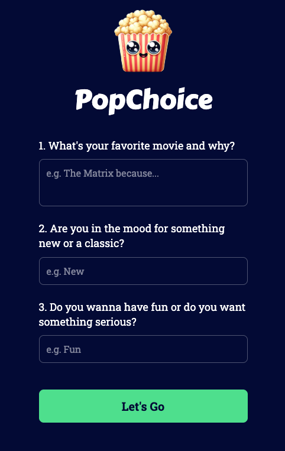
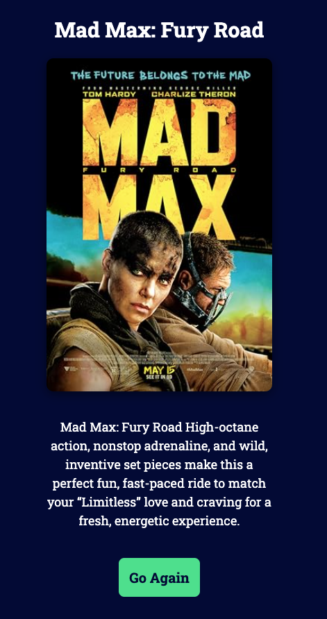

Task: Fixing the UI 

1. I can see the UI is little off, the recommendation should be the whold page:function updateUI(recommendation, posterUrl, title) {
    const main = document.querySelector('main');
    main.innerHTML = `
        

            <h2 class="movie-title">${title}</h2>
            
            
${recommendation}

            <button onclick="location.reload()" class="submit-btn" style="margin-top: 20px;">Go Again</button>
        

    `;
}
Like this: 

with 
.poster dimension; width: 325px, height: 480px
.title dimension width: 326px, height: 39px with Roboto Slab and 30px, and bold

and the whole recommendation layout should be: width: 393px, and height: 852px

In the recommendation we don't need the         <header>
            
            <h1 class="title">PopChoice</h1>
        </header>

* so we can replace the whole 

Please refer to this image for the deisgn: 

This is the current implementation image: 

